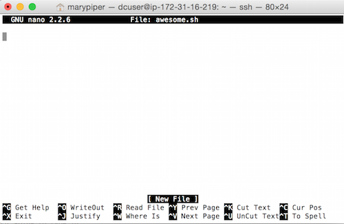
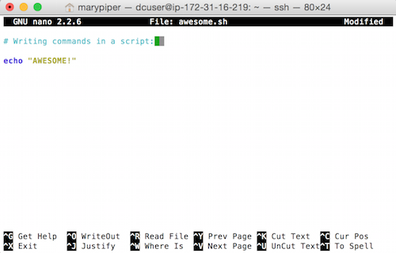

**The UNIX filesystem**
=======================

Learning objectives
-------------------

-  Navigate around the Unix file system
-  Explore the content of files
-  Learn how to manipulate files

Navigating your file system
---------------------------

The part of the operating system responsible for managing files and directories is called the file system. It organizes our data into files, which hold information, and directories (also called “folders”), which hold files or other directories.

Several commands are frequently used to create, inspect, rename, and delete files and directories.

Preparation Magic
~~~~~~~~~~~~~~~~~

.. Tip ::

   If you type the command: PS1='$ ' into your shell, followed by pressing the Enter key, your window should look like our example in this lesson.
   This isn’t necessary to follow along (in fact, your prompt may have other helpful information you want to know about). This is up to you!

   $

The dollar sign is a prompt, which shows us that the shell is waiting for input; your shell may use a different character as a prompt and may add information before the prompt. When typing commands, either from these lessons or from other sources, do not type the prompt, only the commands that follow it.

Let’s find out where we are by running a command called ``pwd`` (which stands for “print working directory”). At any moment, our current working directory is our current default directory, i.e., the directory that the computer assumes we want to run commands in unless we explicitly specify something else. Here, the computer’s response is ``/home/upendra_35``, which is the top level directory within our cloud system:

.. code :: bash

   $ pwd
   /home/upendra_35

Let’s look at how our file system is organized.

Let’s learn a few commands by investigating the folders in the ``dc_sample_data`` directory. But since we don't have directory yet, let's download that data from the datastore

.. code :: bash

   $ cd /scratch

``cd`` stands for ‘change directory’. We are not changing any directory but actually navigate to that particular directory

Change the permissions of the directory so that you can download data into it.

.. code :: bash

   $ sudo chown -hR ${USER} /scratch/

``sudo`` is root access.

Now download the data into that directory

.. code :: bash

   $ wget https://de.cyverse.org/dl/d/CA8E86CA-D089-43AC-93ED-79A257C5815D/osfstorage-archive.zip

.. warning ::

   It will take few minutes to download the data, depending on the internet connection speed. So please be patient

Once the data is downloaded, you need to uncompress it using ``unzip`` command

.. code :: bash

   $ unzip osfstorage-archive.zip

.. Note ::

   It will take few minutes to uncompress the data, depending on the internet connection speed. So please be patient

Now again we ``cd`` into ``dc_sample_data`` folder so that we can investiage it using some basic Linux commands

.. code :: bash

   $ cd dc_sample_data

Let’s see what is inside the folder. Type:

.. code:: bash

   $ ls

You will see:

::

   sra_metadata  untrimmed_fastq

..

   ``ls`` stands for ‘list’ and it lists the contents of a directory.

There are two items listed. What are they? We can use a command line
“modifier” with ``ls`` to get more information; this modifier is called
an argument (more below).

.. code:: bash

   $ ls -F

::

   sra_metadata/  untrimmed_fastq/

Anything with a “/” after it is a directory. Things with a "*" after
them are programs. If there are no decorations after the name, it’s a
file.

You can also use the command ``ls -l`` to see whether items in a
directory are files or directories.

.. code:: bash

   $ ls -l

::

   drwxr-xr-x 2 upendra_35 iplant-everyone 4096 Jun  4 17:59 sra_metadata
   drwxr-xr-x 2 upendra_35 iplant-everyone 4096 Jun  4 17:59 untrimmed_fastq

``ls -l`` gives a lot more information too.

Let’s go into the ``untrimmed_fastq`` directory and see what is in
there.

.. code:: bash

   $ cd untrimmed_fastq
       
   $ ls -F

::

   SRR097977.fastq  SRR098026.fastq

There are two items in this directory with no trailing slashes, so they
are files.

Arguments
~~~~~~~~~

Most commands take additional arguments that control their exact
behavior. For example, ``-F`` and ``-l`` are arguments to ``ls``. The
``ls`` command, like many commands, takes a lot of arguments. Another
useful one is ``-a``, which shows everything, including hidden files.

How do we know what arguments are available for particular commands?
Most commonly used shell commands have a manual. You can access the
manual using the ``man`` command. Try entering:

.. code:: bash

   $ man ls

This will open the manual page for ``ls``. Use the ``space key`` to go
forward and ``b`` to go backwards. When you are done reading, just hit
``q`` to quit.

Commands that are run from the shell can get extremely complicated. To
see an example, open up the manual page for the ``find`` command. No one
can possibly learn all of these arguments, of course. So you will
probably find yourself referring to the manual page frequently.

If the manual page within the terminal is hard to read and traverse,
the manual exists online, use your web searching powers to get it! In
addition to the arguments, you can also find good usage examples
online; Google is your friend.

The Unix directory file structure (a.k.a. where am I?)
------------------------------------------------------

As you’ve already just seen, you can move around in different
directories or folders at the command line. You are probably accustomed
to navigating around the normal way using a GUI (GUI = Graphical User
Interface, pronounced *gooey*), but you will find that it’s not too
difficult once you get the hang of it.

Moving around the file system
~~~~~~~~~~~~~~~~~~~~~~~~~~~~~

Let’s practice moving around a bit. Previously, we moved to the
``untrimmed_fastq`` directory.

To get there, we first changed directories from the folder of our
username to ``/scratch`` to ``dc_sample_data`` then we changed directories to
``untrimmed_fastq``

Let’s draw out how that went.

Now let’s draw some of the other files and folders we could have clicked
on.

This is called a hierarchical file system structure, like an upside down
tree with root (/) at the base that looks like this:

.. figure:: ../img/Slide1.jpg
   :alt: Unix

   Unix

That root (/) is often also called the ‘top’ level.

When you are working at your computer or log in to a remote computer,
you are on one of the branches of that tree, your home directory

Now let’s go do that same navigation at the command line.

Type:

.. code:: bash

   $ cd

This puts you in your home directory. No matter where you are in the
directory system, ``cd`` will always bring you back to your home
directory.

Now using ``cd`` and ``ls``, go in to the ``untrimmed_fastq`` directory
and list its contents.

Let’s also check to see where we are. Sometimes when we’re wandering
around in the file system, it’s easy to lose track of where we are and
get lost.

If you want to know what directory you’re currently in, type:

.. code:: bash

   $ pwd

This stands for ‘print working directory’. The directory you’re
currently working in.

What if we want to move back up and out of the ``untrimmed_fastq``
directory? Can we just type ``cd dc_sample_data``? Try it and see what
happens.

To go ‘back up a level’ we need to use ``..``

Type

.. code:: bash

   $ cd ..

.. Note ::

   ``..`` denotes parent directory, and you can use it anywhere in the system to go back to the parent directory.

Now do ``ls`` and ``pwd``.

--------------

**Exercise**

Now we’re going to try a hunt. Find a hidden directory in
``dc_sample_data`` and list its contents. What is the name of the text
file in the hidden directory?

Hint: hidden files and folders in unix start with ``.``, for example
``.my_hidden_directory \* \* \*``

Full vs. Relative Paths
~~~~~~~~~~~~~~~~~~~~~~~

The ``cd`` command takes an argument which is the directory name.
Directories can be specified using either a *relative path* or a *full
path*. As we know, the directories on the computer are arranged into a
hierarchy. The full path tells you where a directory is in that
hierarchy.

Navigate to the scratch directory (``cd /scratch``). Now, enter the ``pwd`` command
and you should see:

::

   /scratch

which is the full path for your home directory. This tells you that you
are in a directory called ``scratch``, which sits inside the very top directory
called ``root`` which is usually referred to as the *root directory*. 

Now enter the following command:

.. code:: bash

   $ cd dc_sample_data/.hidden

This jumps to ``.hidden``. This command takes us to
the ``hidden`` directory. But instead of specifying the full path
(``/scratch/dc_sample_data/.hidden``), we specified a *relative
path*. In other words, we specified the path **relative to our current
directory**.

A full path always starts with a ``/``, a relative path does not.

A relative path is like getting directions from someone on the street.
They tell you to “go right at the Stop sign, and then turn left on Main
Street”. That works great if you’re standing there together, but not so
well if you’re trying to tell someone how to get there from another
country. A full path is like GPS coordinates. It tells you exactly where
something is no matter where you are right now.

You can usually use either a full path or a relative path depending on
what is most convenient. If we are in the home directory, it is more
convenient to just enter the relative path since it involves less
typing.

Over time, it will become easier for you to keep a mental note of the
structure of the directories that you are using and how to quickly
navigate amongst them.

Examining the contents of other directories
~~~~~~~~~~~~~~~~~~~~~~~~~~~~~~~~~~~~~~~~~~~

By default, the ``ls`` commands lists the contents of the working
directory (i.e. the directory you are in). You can always find the
directory you are in using the ``pwd`` command. However, you can also
give ``ls`` the names of other directories to view.

Navigate to the ``scratch`` directory if you are not already there.

Type:

.. code:: bash

   $ cd /scratch

Then enter the command:

.. code:: bash

   $ ls dc_sample_data

This will list the contents of the ``dc_sample_data`` directory without
you having to navigate there.

The ``cd`` command works in a similar way. Try entering:

.. code:: bash
       
   $ cd dc_sample_data/untrimmed_fastq
       
   $ pwd

You will jump directly to ``untrimmed_fastq`` without having to step
through the intermediate directory.

-------------------------
**Exercise**

List the ``SRR097977.fastq`` file from your scratch directory without
changing directories \***\*

Saving time with shortcuts
--------------------------

There are several shortcuts which you should know about, but today we
are going to talk about only a few. As you continue to work with the
shell and on the terminal a lot more, you will come across and hopefully
adapt many other shortcuts.

Dealing with the home directory is very common. So, in the shell the
tilde character, ``~``, is a shortcut for your home directory. Navigate to
the ``dc_sample_data/sra_metadata/`` directory:

.. code:: bash

   $ cd /scratch
       
   $ cd dc_sample_data/sra_metadata/

Then enter the command:

.. code:: bash

   $ ls ~

This prints the contents of your home directory, without you having to
type the full path.

Another shortcut is the “..”, which we encountered earlier:

.. code:: bash

   $ ls ..

The shortcut ``..`` always refers to the directory above your current
directory. So, it prints the contents of the
``/scratch/dc_sample_data``. You can chain these together, so:

.. code:: bash

   $ ls ../../

prints the contents of ``/scratch`` which is your home directory.

Finally, the special directory ``.`` always refers to your current
directory.

.. code:: bash

   $ ls .

So, ``ls``, ``ls .``, and ``ls ././././.`` all do the same thing, they
print the contents of the current directory. This may seem like a
useless shortcut right now, but it is needed to specify a destination,
e.g. ``cp ../data/counts.txt .`` or
``mv ~/james-scripts/parse-fasta.sh .``.

To summarize, while you are in your home directory, the commands
``ls ~``, ``ls ~/.``, and ``ls /home/dcuser`` all do exactly the same
thing. These shortcuts are not necessary, but they are really
convenient!

Tab Completion
~~~~~~~~~~~~~~

Tab completion is an important shortcut to know; it improves efficiency
navigating the file system and helps avoid typos.

To practice with tab completion, let’s first navigate to ``scratch``
directory.

.. code:: bash

   $ cd /scratch

Typing out directory names can waste a lot of time. When you start
typing out the name of a directory, then hit the tab key, the shell will
try to fill in the rest of the directory name. For example, type ``cd``
to get back to your home directy, then enter:

.. code:: bash

   $ cd /scratch/dc_<>

The shell will fill in the rest of the directory name for
``dc_sample_data``. Now go to ``dc_sample_data/untrimmed_fastq``

.. code:: bash

   $ cd un<tab>
   $ ls SR<tab><tab>

When you hit the first tab, nothing happens. The reason is that there
are multiple directories in the home directory which start with ``SR``.
Thus, the shell does not know which one to fill in. When you hit tab
again, the shell will list the possible choices.

Wild cards
~~~~~~~~~~

Navigate to the ``/scratch/dc_sample_data/untrimmed_fastq`` directory. This
directory contains FASTQ files from our RNA-Seq experiment.

The ``*`` character is a shortcut for “everything”. Thus, if you enter
``ls *``, you will see all of the contents of a given directory. Now try
this command:

.. code:: bash

   $ ls *fastq

This lists every file that ends with a ``fastq``. This command:

.. code:: bash

   $ ls SRR*

lists every file in that starts with the characters ``SRR``.

.. code:: bash

   $ ls *977.fastq

Lists only the file that ends with ‘977.fastq’

So how does this actually work? Well…when the shell (bash) sees a word
that contains the ``*`` character, it automatically looks for filenames
that match the given pattern.

--------------

**Exercise**

1. Change directories to your home directory, and list the contents of
   ``/scratch/dc_sample_data/sra_metadata/`` without changing directories again.

2. List the contents of the /bin directory. Do you see anything familiar
   in there? How can you tell these are programs rather than plain
   files?

3. Do each of the following using a single ``ls`` command without
   navigating to a different directory.

   1. List all of the files in ``/bin`` that start with the letter ’c
   2. List all of the files in ``/bin`` that contain the letter ‘a’
   3. List all of the files in ``/bin`` that end with the letter ‘o’

   BONUS: List all of the files in ‘/bin’ that contain the letter ‘a’ or
   ‘c’

--------------

Command History
---------------

You can easily access previous commands. Hit the up arrow. Hit it again.
You can step backwards through your command history. The down arrow
takes your forwards in the command history.

``^-C`` will cancel the command you are writing, and give you a fresh
prompt.

``^-R`` will do a reverse-search through your command history. This is very
useful.

You can also review your recent commands with the ``history`` command.
Just enter:

.. code:: bash

   $ history

to see a numbered list of recent commands, including this just issued
``history`` command. You can reuse one of these commands directly by
referring to the number of that command.

If your history looked like this:

::

   259  ls *
   260  ls /usr/bin/*.sh
   261  ls *R1*fastq

then you could repeat command #260 by simply entering:

.. code:: bash

   $ !260

(that’s an exclamation mark). You will be glad you learned this when you
try to re-run very complicated commands.

--------------

**Exercise**

1. Find the line number in your history for the last exercise (listing
   files in /bin) and reissue that command.

--------------
Examining Files
---------------

We now know how to move around the file system and look at the contents
of directories, but how do we look at the contents of files?

The easiest way (but really not the ideal way in most situations) to
examine a file is to just print out all of the contents using the
command ``cat``. Enter the following command:

.. code:: bash

   $ cd /scratch/dc_sample_data/sra_metadata
   $ cat SraRunTable.txt 

This prints out the all the contents of the the ``SraRunTable.txt`` to
the screen.

.. Note :: 

   ``cat`` stands for concatenate; it has many uses and printing the
   contents of a files onto the terminal is one of them.

What does this file contain?

``cat`` is a terrific command, but when the file is really big, it
should be avoided; ``less``, is preferred for files larger than a few
bytes. Let’s take a look at the fastq files in
``/scratch/dc_sample_data/untrimmed_fastq``. These files are quite large, so we
probably do not want to use the ``cat`` command to look at them.
Instead, we can use the ``less`` command.

Move to the ``untrimmed_fastq`` directory and enter the following
command:

.. code:: bash

   $ cd /scratch/dc_sample_data/untrimmed_fastq/
   $ less SRR098026.fastq

``less`` opens the file, and lets you navigate through it. The commands
are identical to the ``man`` program.

**Some commands in ``less``**

+---------+------------------------+
| key     | action                 |
+=========+========================+
| “space” | to go forward          |
+---------+------------------------+
| “b”     | to go backwarsd        |
+---------+------------------------+
| “g”     | to go to the beginning |
+---------+------------------------+
| “G”     | to go to the end       |
+---------+------------------------+
| “q”     | to quit                |
+---------+------------------------+

``less`` also gives you a way of searching through files. Just hit the
``/`` key to begin a search. Enter the name of the word you would like to
search for and hit enter. It will jump to the next location where that
word is found. If you hit ``/`` then “enter”, ``less`` will just repeat
the previous search. ``less`` searches from the current location and
works its way forward. If you are at the end of the file and search the
word, ``less`` will not find it. You need to go to the beginning of the
file and search.

For instance, let’s search for the sequence ``GTTGATC`` in our file. You
can see that we go right to that sequence and can see what it looks
like.

Remember, the ``man`` program actually uses ``less`` internally and
therefore uses the same commands, so you can search documentation using
``/`` as well!

There’s another way that we can look at files, and in this case, just
look at part of them. This can be particularly useful if we just want to
see the beginning or end of the file, or see how it’s formatted.

The commands are ``head`` and ``tail`` and they just let you look at the
beginning and end of a file respectively.

.. code:: bash

   $ head SRR098026.fastq

   $ tail SRR098026.fastq

The ``-n`` option to either of these commands can be used to print the
first or last ``n`` lines of a file. To print the first line of the file
use:

.. code:: bash

   $ head -n 1 SRR098026.fastq

Creating, moving, copying, and removing
---------------------------------------

Now we can move around in the file structure, look at files, and search
files. But what if we want to do normal things like copy files or move
them around or get rid of them.

Our raw data in this case is fastq files. We don’t want to change the
original files, so let’s make a copy to work with.

Lets copy the file using the ``cp`` command. The copy command requires 2
things, the name of the file to copy, and the location to copy it to.
Navigate to the ``untrimmed_fastq`` directory and enter:

.. code:: bash

   $ cp SRR098026.fastq SRR098026-copy.fastq
       
   $ ls -F

::

   SRR097977.fastq  SRR098026-copy.fastq  SRR098026.fastq 

Now ``SRR098026-copy.fastq`` has been created as a copy of ``SRR098026.fastq``

Let’s make a ``backup`` directory where we can put this file.

The ``mkdir`` command is used to make a directory. Just enter ``mkdir``
followed by a space, then the directory name.

.. code:: bash

   $ mkdir backup

We can now move our backed up file in to this directory. We can move
files around using the command ``mv``. Enter this command:

.. code:: bash

   $ mv *-copy.fastq backup
       
   $ ls -al backup

::

   total 52
   drwxr-xr-x 2 upendra_35 iplant-everyone  4096 Jun  4 19:20 .
   drwxr-xr-x 3 upendra_35 iplant-everyone  4096 Jun  4 19:20 ..
   -rw------- 1 upendra_35 iplant-everyone 43332 Jun  4 19:19 SRR098026-copy.fastq

The ``mv`` command is also how you rename files. Since this file is so
important, let’s rename it:

.. code:: bash

   $ cd backup
       
   $ mv SRR098026-copy.fastq SRR098026-copy.fastq_DO_NOT_TOUCH!
       
   $ ls 

::

   SRR098026-copy.fastq_DO_NOT_TOUCH!

Finally, we decided this was silly and want to start over.

.. code:: bash

   $ rm SRR098026-copy.fastq_DO_NOT_TOUCH!

.. Note ::

   The ``rm`` file permanently removes the file. Be careful with this
   command. The shell doesn’t just nicely put the files in the Trash,
   they’re really gone!

   Same with moving and renaming files. It will **not** ask you if you
   are sure that you want to “replace existing file”.

--------------
**Exercise**

1. Change directories to the ``untrimmed_fastq`` folder and create a
   backup directory called ``new_backup``
2. Copy both fastq files files there with 1 command
--------------

By default, ``rm``, will NOT delete directories. You can tell ``rm`` to
delete a directory using the ``-r`` option. Let’s delete our ``backup``
and ``new_backup`` directories we just made. Enter the following
command:

.. code:: bash

   $ rm -r backup
   $ rm -r new_backup

Writing files
-------------

We’ve been able to do a lot of work with files that already exist, but
what if we want to write our own files. Obviously, we’re not going to
type in a FASTA file, but you’ll see as we go through other tutorials,
there are a lot of reasons we’ll want to write a file, or edit an
existing file.

To write in files, we’re going to use the program ``nano``. We’re going
to create a file within your home direcory with the name ``awesome.sh``.

.. code:: bash

   $ cd /scratch
   $ nano awesome.sh

Now you have something that looks like

Type in your command, so it looks like

Now we want to save the file and exit. At the bottom of nano, you see
the “^X Exit”. That means that we use Ctrl-X to exit. Type ``Ctrl-X``.
It will ask if you want to save it. Type ``y`` for yes. Then it asks if
you want that file name. Hit ‘Enter’.

Now you’ve written a file. You can take a look at it with ``less`` or
``cat``, or open it up again and edit it.

We’re going to come back and use this file in just a bit.
